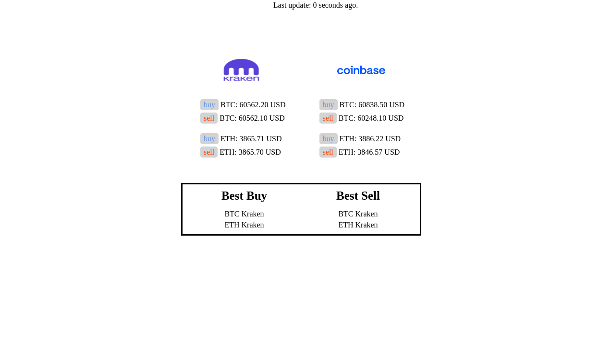

# UPDATE
The backend was originally a basic Python script running on http.server. It has been rewritten in Rust, and uses the Actix-web framework.
# coinPrices
A webpage that shows the prices on two crypto exchanges

Note that the **buy** price is equivalent to the *lowest ask*. That is, if you were to buy an asset right now, the lowest price you can get is the lowest price someone is willing to sell it for. This is why the buy price is higher than the sell price (sell = *highest bid*, i.e the most someone is willing to pay).
# Dependencies
In order to run this software, you will need to install the following:
1. [Cargo](https://doc.rust-lang.org/cargo/getting-started/installation.html)
2. [Node](https://nodejs.org/en/)
3. [VueCLI](https://cli.vuejs.org/guide/installation.html)

Once you've installed these, you can move to the next section.
# Usage
To start the server, run `sh run.sh`.

This will execute `cargo run --release`, which may need to download and compile some crates from crates.io, as well as `npm run serve`.

Once the program is running, open `localhost:8080` in your browser to view the webpage.

You can try shutting the server off and back on to see how it affects the webpage.

## Bandwidth test
If you want to run a simple bandwidth test, run the server, then run `python3 rust_test.py`. This program simulates 1000 users sending the server a get request, and then prints the number of seconds required to serve 100 users.
