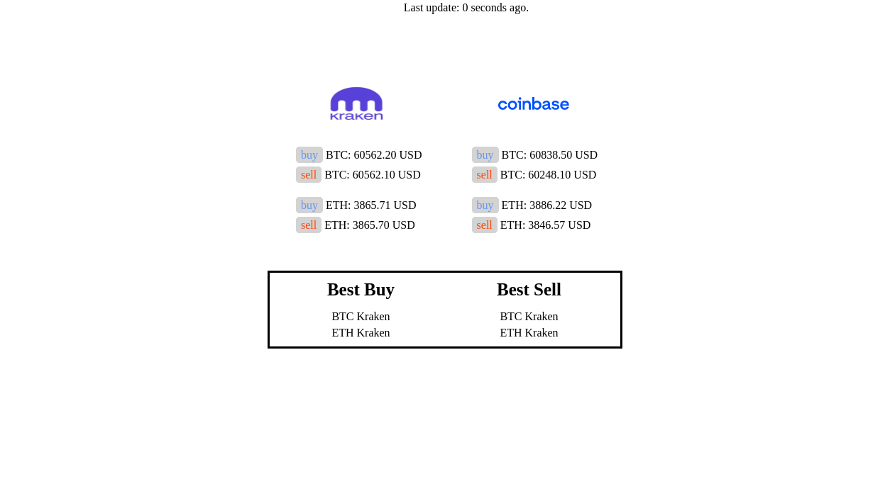

# coinPrices
A webpage that shows the prices on two crypto exchanges

Note that the **buy** price is equivalent to the *lowest ask*. That is, if you were to buy an asset right now, the lowest price you can get is the lowest price someone is willing to sell it for. This is why the buy price is higher than the sell price (sell = *highest bid*, i.e the most someone is willing to pay).
# Usage
To start the server, run `python3 run_app.py`.

It will print out the process IDs for `crawler.py` and `server.py`.
To shut the server and crawler down, just hit the program with sigint via `ctrl + c`, or kill the processes
manually using the PIDs printed earlier.

Next, open `localhost:8000` in your browser to view the webpage.

You can try shutting the server off and back on to see how it affects the webpage.

## Bandwidth test
If you want to run a simple bandwidth test, run `python3 stress_test.py`. This program simulates 1000 users sending the server a get request, and then prints the number of seconds required to serve 100 users.
